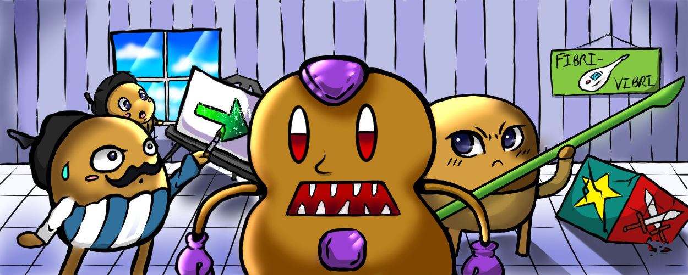
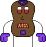
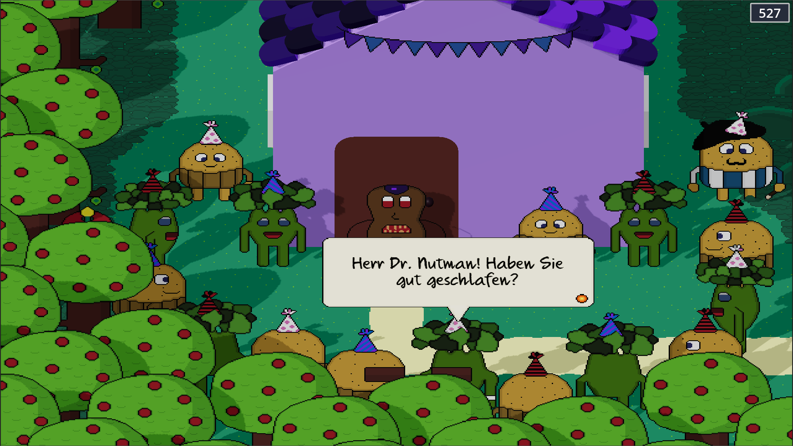
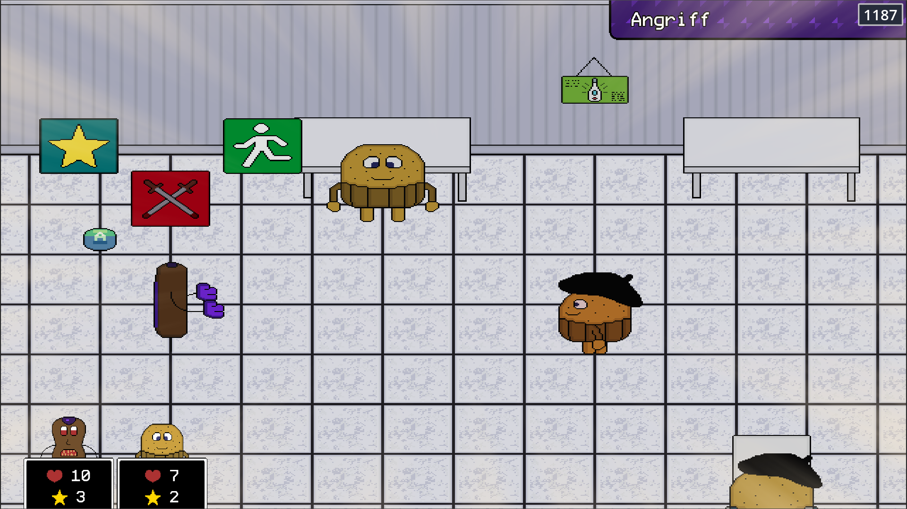
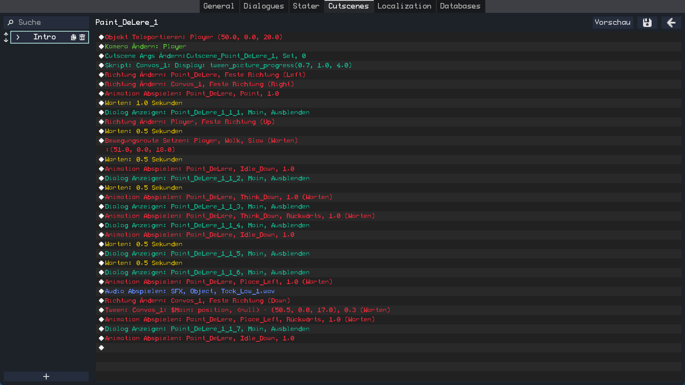
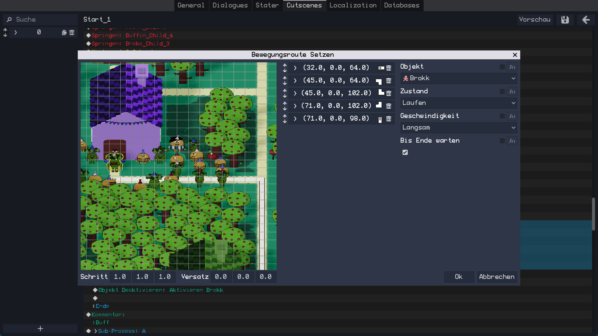
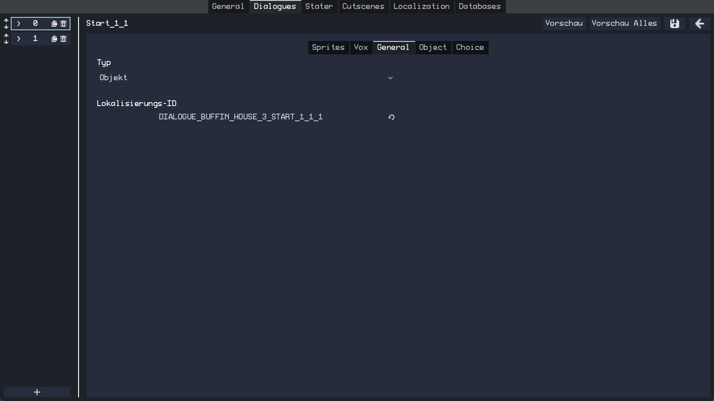
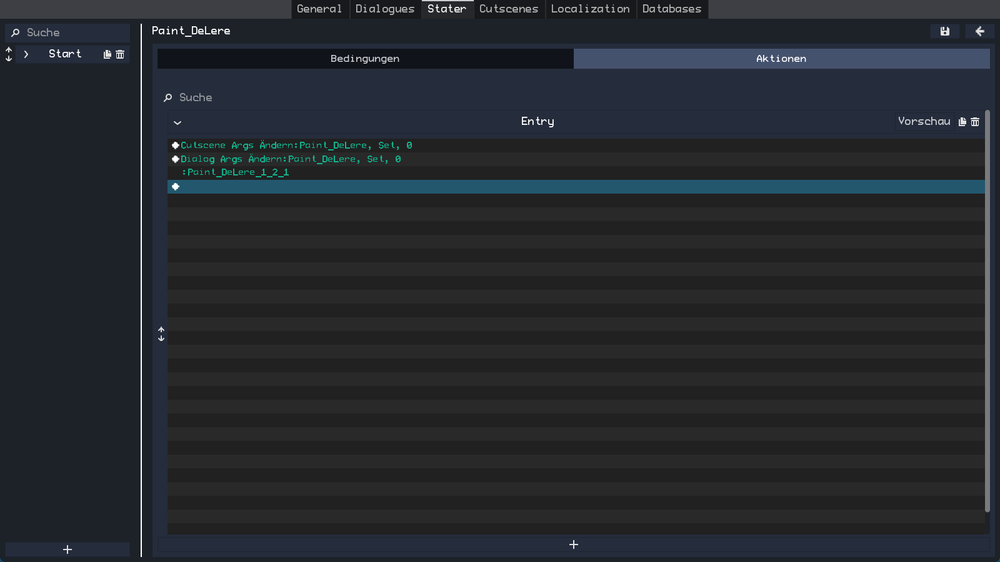
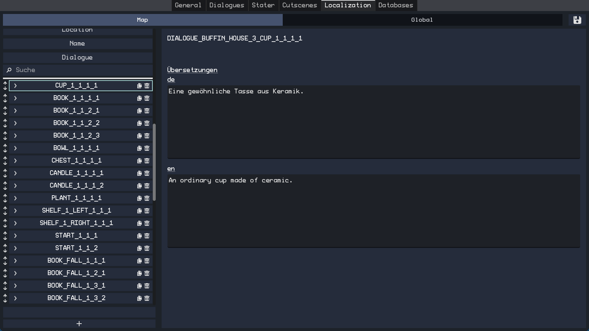

# Dr. Nutman 2

Dr. Nutman 2 is a top-down RPG made using Godot Engine. It is built upon a flexible RPG framework that works for both 2D and 3D.

## Background 
Dr. Nutman is a potato that was raised *poorly* by his peanut parents. To cope with his difficult childhood, he started to collect amethysts that now also decorate his body. When he got older, he decided to leave his parents forever and strive through the woods to find a new place to live. After some time, he arrived at Broko Town, the home of the Brokos and <fonsdst color="orange">Buffins and discovered, that their current leader Mc Rollunosu despises the Brokos and wants to get rid off them. Luckily, Dr. Nutman is able to defeat him and bring peace. With his new life in Broko Town, a new danger is drawing near...

## Gameplay

<ul>
    <li>Rich dialogues and character development</li>
    <li>Minigames</li>
    <li>Turn-based battle system</li>
    <li>Fun quests and all sorts of challenges</li>
</ul>

## RPG Framework
This game is built upon a framework that was created to lower the effort to develop specifically RPG games. It features a lot of extendable and flexible systems that are needed in almost any (RPG) game. It works in 2D and 3D while sharing most of the code.

<ul>
    <li>Cutscene-, Dialogue- and State-Editor</li>
    <li>Localization-Editor</li>
    <li>Cutscene System</li>
    <li>Dialogue System</li>
    <li>Inventory System</li>
    <li>Side-View Battle System</li>
    <li>Equipables System</li>
    <li>Value-Editor</li>
    <li>Audio Manager</li>
    <li>Scene Manager</li>
    <li>Title Screen</li>
    <li>Main Menu</li>
    <li>Saving and Loading</li>
    <li>Plenty of Object-Components</li>
    <li>Value-Editor</li>
    <li>Versioning and save file validation</li>
    <li>... and more</li>
</ul>

### Cutscene-Editor

Offers a rich set of commands that are executed subsequentually to create any cutscene imaginable. Each command features a preview that represents the current state of the scene before the command is executed. Here are some of the available commands:
<ul>
    <li>Set Move Route</li>
    <li>Tween</li>
    <li>Play Animation</li>
    <li>Move Free Camera</li>
    <li>Conditional Branch</li>
    <li>Loop</li>
    <li>Sub-Process</li>
    <li>Change Equipables</li>
    <li>Wait</li>
    <li>Play Audio</li>
    <li>Script</li>
    <li>Show Dialogue</li>
</ul>

### Dialogue-Editor

Transforms your Localization IDs into Text-, Info- or Choice dialogues. It allows you to specify Sprites, Vox, Choices and the Object belonging to the text. These dialogues can then be used within the Cutscene-System or displayed individually.

### State-Editor

Set the state of objects by specifying actions that are executed when certain conditions are fulfilled. The actions use the Cutscene-Editor to change the state of objects.

### Localization-Editor

Add, Edit or Delete Localization IDs. Translate your game in a well-organized manner.